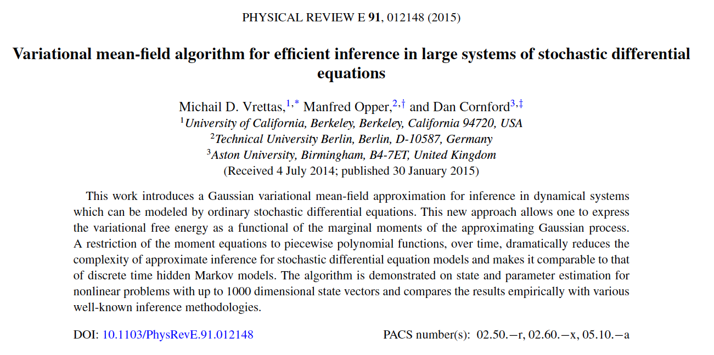

# MeanFieldVarGP

**Mean field variational Gaussian process algorithm**

This repository contains a python3 implementation of the variational mean field
algorithm as described in the paper:

[M. D. Vrettas, M. Opper and D. Cornford (2015)](
https://journals.aps.org/pre/abstract/10.1103/PhysRevE.91.012148).
"Variational mean-field algorithm for efficient inference in large systems
of stochastic differential equations", Physical Review E. vol. 91, 2015, 012148.

## Expectations and gradients

In order to use the algorithm on a new system, one has to derive first a few expression
that are system dependent (as described in the paper). Namely, the integral of _Esde(t)_
in [t0, tf] and its derivatives:

1. dEsde(t)/dm: with respect to the mean points
2. dEsde(t)/ds: with respect to the variance points

These expressions can be computed in paper and then put into code. But here we provide an
automated solution based on **SymPy**. We show how one can derive these expression and directly
put them in code and use them. This is shown in two examples:

1. [How to compute energies.](src/examples/how_to_compute_energies.ipynb)
2. [How to compute integrals.](src/examples/how_to_compute_integrals.ipynb)

**Note:** Even though the integrals can be computed in analytic form (at least for polynomial
drift functions), one must be aware that the resulting expressions are "enormous" in size,
resulting in very large files that are prone to numerical errors. In addition, **SymPy** at
least on my ten years old laptop, was not able to compute all the integrals.

Therefore, I choose to estimate only the energy terms along with its gradients, and then use
numerical integration to get the integral values. To improve performance I have parallelized
these numerical integrations, so according to the system resources that one has the parallel
pool can be tuned to include more CPUs (setting the option '**n_jobs=**' inside the method
*free_energy.E_sde()*).

## Required packages

The recommended version is **Python3.8**. To simplify the required packages just use:

    $ pip install -r requirements.txt

## Examples

We provide three examples on how to use this method:

1. [Double-Well (1D).](src/examples/example_DW.ipynb) The first one is a one-dimensional DW system.
Even though the mean-field algorithm is meant to be applied on high dimensional system, this 1D
example here helps with debugging the algorithm at the early stages of development. For these
low dimensional systems the original (full) **VGPA** algorithm is preferred because it provides
a one-dimensional version that makes everything much faster.

2. [Lorenz '63 (3D).](src/examples/example_L63.ipynb) The second system considered is the chaotic
Lorenz 1963 model (the butterfly model). Again, even though this is not very high dimensional
it helps with ensuring that the code will perform as expected on more than 1D systems, in terms
of matrix multiplications.

3. [Lorenz '96 (40D)](src/examples/example_L96.ipynb) The third system provided here is a stochastic
version of the famous Lorenz 1996 model (minimal weather like model). The original paper describes
a system with forty dimensions (D=40). But the cool thing is that since the system equations are
in a circular framework the system can actually be extended to any number of dimensions.
As described in the paper, we applied this algorithm for D=1000. Here we have the example with
D=40, but we have tested it for higher dimensions too.

### Contact

For any questions / comments please contact me at: vrettasm@gmail.com
